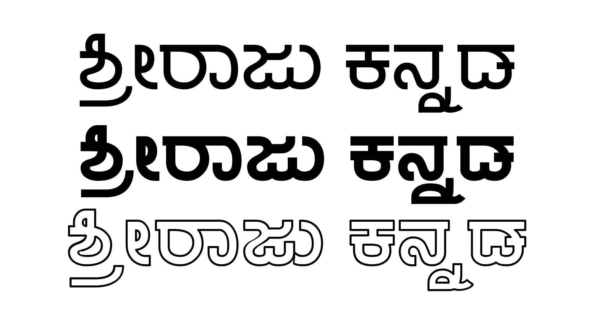

# Sri Raju Fonts (Unofficial Repository)

This is an unofficial open-source mirror of the **Sri Raju Font Family**, a Kannada typeface designed by **Nagalingappa Badiger** and published by journalist and author **Sugata Srinivasaraju** to commemorate the 75th birth anniversary of his father, **C. Srinivasaraju**.

> 🎁 Originally shared by the publisher on [sugataraju.blogspot.com](https://sugataraju.blogspot.com/2019/01/free-download-sriraju-type-family-with.html)

---
## 🔤 Supported Scripts

- **Kannada** (primary)
- **Latin (Basic English)**

---

## 🧾 License

The fonts were originally shared publicly for free use. While no formal license was included, they appear to be intended for both **personal and commercial** usage.

> ⚠️ If you are the creator or publisher and wish to provide a specific license, please open an issue or contact us. Suggested license format: [SIL Open Font License (OFL)](https://scripts.sil.org/OFL)

---

## 📸 Preview

  

---

## ✍️ Credits

- **Typeface Designer**: [Nagalingappa Badiger]
- **Publisher**: [Sugata Srinivasaraju](https://sugataraju.blogspot.com/)
- **Original Blog**: [Free Download: Sriraju Type Family](https://sugataraju.blogspot.com/2019/01/free-download-sriraju-type-family-with.html)

---

## 🛠 Maintainer

This repository is maintained unofficially by the Kannada type and design community to preserve and promote native scripts.

